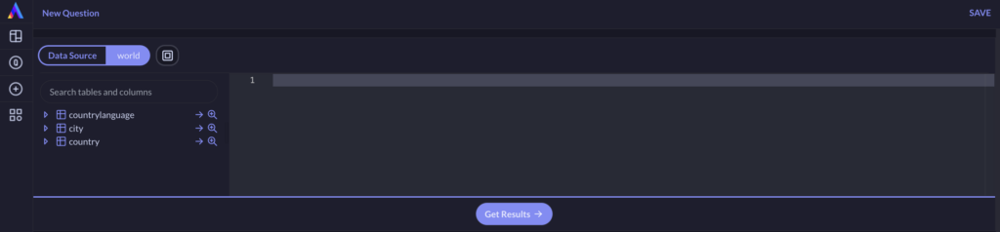
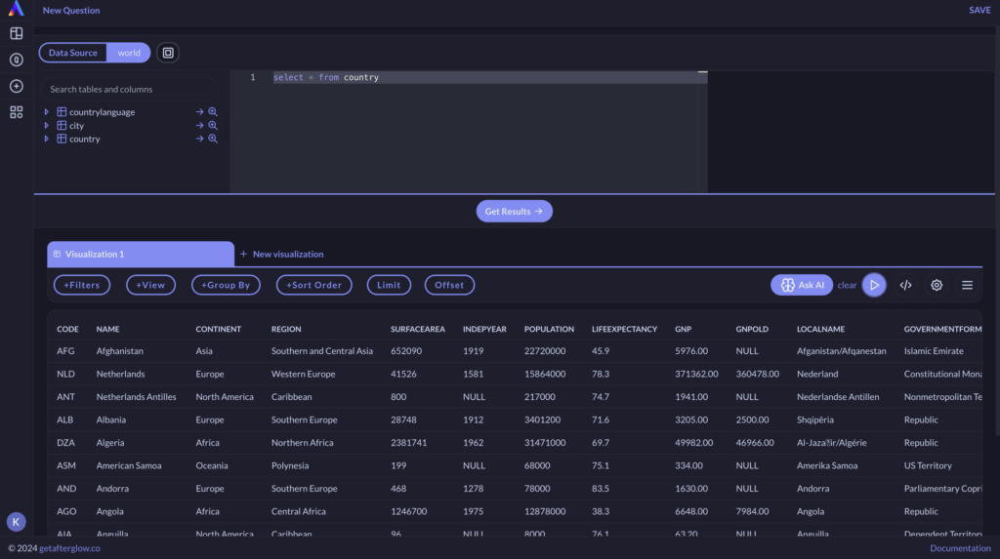
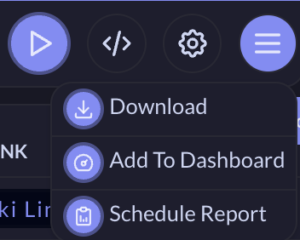
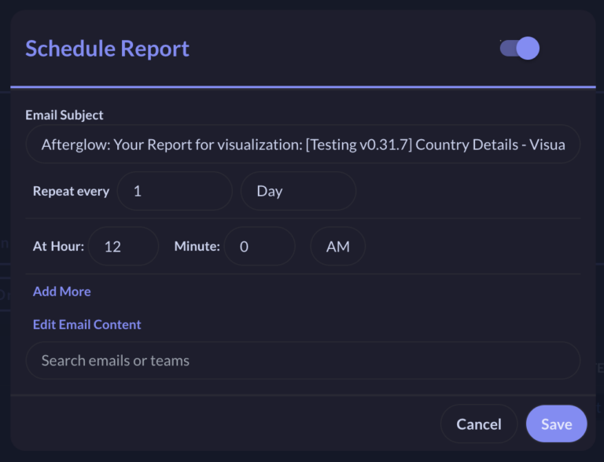
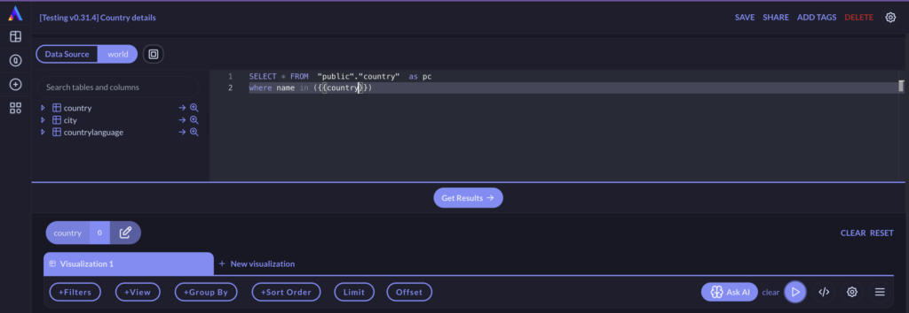
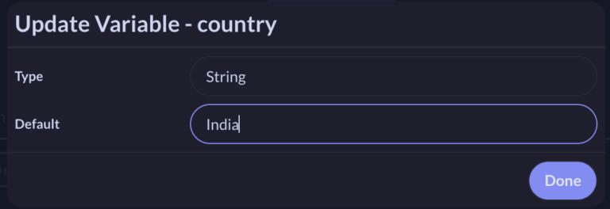

# Questions

## Overview

Questions are the building blocks of Afterglow. A question lets you fetch data for your answer and give you powerful constructs to play with the data.

You can create question using:

- SQL Builder
- Drag & drop UI
  Results from Questions can be visualised as:

- Tables
- Charts (Line / Bar / Area / Scatter / Pie / Combination)
- Numbers
- Pivot Table
- Custom Canvas

Results can be further enhanced by:

- Using UI filters for easy filtering
- Customisable Formatter to represent data beautifully
- Local Filters for instant column search

Results can be shared using:

- Links
- Directly sharing to other users
- Download to self
- Schedule to users

You can also make questions powerful by:

- Adding Action to the results
- Adding variable to questions
- Creating multiple visualisations in a question to group similar data together

## Creating a Question

### Creating a Question using SQL Builder

Go to “New Question” in Left Nav which opens up SQL builder by default. Select your data source and you will see the SQL builder interface.

You will start seeing the Tables & Columns in the Builder’s left pane. You can use it to:

- Search for a column or table or just expand table to see columns
- Preview the table by clicking lens icon
- Fill a table or column name by clicking on arrow icon

You can start writing your query in the SQL editor. It has a powerful autocomplete feature to help write statements faster. You can also explore other features by using the right click menu like Command Palette, Snippet creation and Generating SQL from AI Assistant.

After your query is complete, click on “Get Results” to see results.

Let’s save our questions by clicking on “Save” and providing a name to the question.

### Creating Question with API Data source

You can also use API as data sources to get your data. Learn More.

### Adding Tags to a Question

Click on Add Tags to add a tag to the question. Tags make it easy to filter questions in the All Questions page. You can add a new tag or select an existing one.

### Sharing a Question

You can share your question by clicking `Share` on the Top right Nav:

- Add Email id to share the question with users
- Copy the link to share with users

Only users who are part of organisation will be able to see the question.

### Scheduling a Question

You can schedule a question to get regular reports. Click on `Schedule Report` in the hamburger menu in Results.

You will see the Schedule Reports modal as shown below:

You can change the following:

- Email subject
- Frequency: Select on Hour / Day / Week / Month level and can select multiple values in a single level by clicking Add More
- Email Content: You can modify the content as per need. Use `{{preview_data}}` for data preview and `{{download_link:any_text}}` for download link.
- Recipient List: Enter relevant user emails

### Adding Variable to a Question

A variable enables you to change input on a saved question and can serve use cases like:

- Getting customer details for a given Phone number
- Adding custom filters e.g. Date, List of items etc

You can create a variable by just typing `{{variable_name}}` in the query. This will create a variable section in the Visualisation section as show below:

You can click on edit and change the following:

- **Variable Type:** String, Integer and Date types are supported
- **Default Value:** This is the value with which question will always load
  For this example, we will select the String type variable.

Click on Get results to run your query and see results.

You can also use `Debug Info` in Visualisation section to see the final resolved query

### Using System Variable

Afterglow also supports system variable where you can add confidential information like API Keys and use it in SQL builder. This variable will not be shown in the `Debug info` to keep them private.

Create a system variable by going to `User -> Settings -> System Variables`. Click on Add variable for a new one.

You can refer a system variable as `{{sys::variable_name}}` in the SQL builder.

### Adding API Action to a Question

Learn more about API Actions here.

## Modifying Results

Visualisation section is the one where results are shown. It can have multiple visualisations and all of them use the Main Question query as the base.

Each Visualisation section has following components:

- UI Filters: Perform functions like Filter, Group, Sort, Views using the UI
- Debug Info toggle: Shows the actual query
- Settings: To modify Results view through different visualisation options
- Hamburger Menu: To Download results, Add Question to Dashboard or Schedule the Question

### Visualisation options

Afterglow support the following visualisation which you can apply to the results:

- Number
- Table / Transposed Table
- Line Chart
- Bar Chart
- Area Chart
- Bubble/Scatter Chart
- Funnel
- Custom Canvas

### UI Filters

You can use the Menu panel to perform basic data manipulation using the UI. You can also add raw input by selecting the <> toggle.

The UI filters which are available are:

- Filters: Add the required Filter for your column. You can select a variety of expressions to apply filter.
- Views: Select the column which you want to see in the results. You can also aggregate the results in views. All Supported aggregations are:
  - Count of Rows
  - Min of
  - Max of
  - Sum
  - Average
  - Percentile
  - Standard deviation
  - Standard Variation
- Group by: Group the results by specified columns. You can group by multiple columns.
- Sort Order: Select columns and their sort order to sort the results. You can use multiple columns to sort the data.
- Limit: Limit the results by required number
- Offset: Offset the results by required number

### Customisable Formatter
